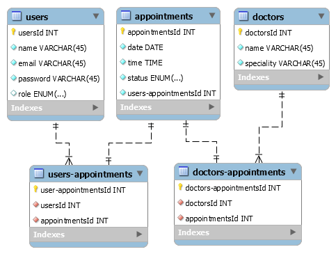

# Table of contents
- [Configuration](#Configuration)
- [Run](#Run)
- [Authentication](#Authentication)
- [Authorization](#Authorization)
- [Folder structure](#Project-folder-structure)
- [DB](#DB-Structure)
- [Endpoints](#Endpoints)
    - [User enpoints](#Users)
    - [Appointment enpoints](#Appoinments)
#

# My Appointments API
Simple API rest for backend exercise with local database, using Node + Express, Sequelize, MySQL and Postman.
#

## Configuration
- Backend: Download and install Node.js
- Data Base: Download and install MySQL, write the database name on the ***db*** environmental variable in ***.env*** file at the project root, by default this value is

        API_Citas

- Port: Set ***port*** variable in the environmental variable  file ***.env*** by default this value is 3000

- MySQL: Set development ***username*** and ***password*** in the ***config.json*** file, by default this values are:

        {
        "development": {
        "username": "root",
        "password": "root",
        "database": "API_Citas",
        "host": "127.0.0.1",
        "dialect": "mysql"
        }

- JWT secret: Set ***secret*** variable in the environmental variable file ***.env*** by default this value is *1jmi006lz2DLsmbcyqacUhlAavDvjHjf2VtpoNTeppt*

- Installing Dependencies: on root folder

        npm install

- Install Postman
#

## Run

Open the ***app.js*** file with node on the root folder of the project

        node app.js

The admin user credentials are 

email: admin@admin.com

password: 1234

You can now start making requests using your API rest development platform.
#

## Project folder structure
                ├───assets
                ├───config
                ├───controllers
                ├───middleware
                ├───migrations
                ├───models
                ├───routes
                └───seeders
#

## Authentication
New users will have to signup in order to access the service endpoints.

Registered users can login and once the user is logged in, each subsequent request must include a **JSON Web Token**, which allows the user to access routes, services, and resources that are permitted with that token.
#

## Authorization
All new users are created with 'client' role by default, only the 'admin' role user can create appointments.
#

## DB Structure

#

## Endpoints
The supported request body format is JSON

All endpoints but the login, logout and signup require authentication by JWT sent on the request via headers

- headers:
  - authentication: {token}

## Users

The user request data need to be sent through headers:

- **POST** /users/signup

        {
                "email": "user@example.com",
                "name": "username",
                "password": "1234"
        }

- **POST** /auth/login

        {
                "email": "user@example.com",
                "password": "1234"

        }

- **GET** /auth/logout

- **GET** /users/dashboard
#
## Appointments
- **POST** /appointments/newApptts

        {
                "date": "2021-04-12,
                "time": "18:00:00.000Z"",
                "status": "pending",
                "usersId": "2",
                "doctorsId": "1"
        }

- **POST** /appointments/appttsStts

- **GET** /appointments/appttsDlt/:id
#

### Authors
[Jarki Melendez](https://www.linkedin.com/in/jarki-melendez/)

[Israel Sanchez](https://www.linkedin.com/in/danny-isrrael-sanchez-ortiz-704785177/)

[TOP](#Table-of-contents)